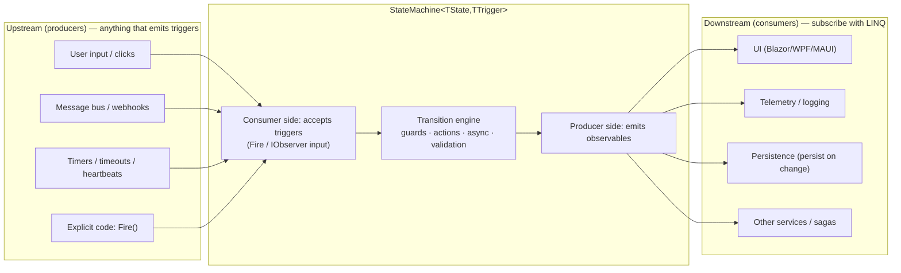
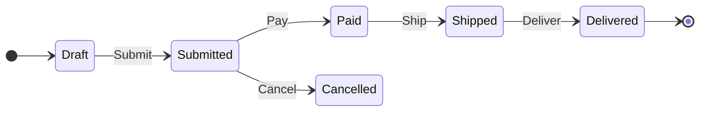

# RxStateMachine — Product Requirements Document

> **Status:** Draft </br>
> **Last Updated:** 2026-08-24 </br>
> **Target frameworks:** `netstandard2.0` + `net10.0` </br>
> **Core dependency:** System.Reactive (Rx.NET)

---

## 1. Executive Summary

We want a **generic, type-safe, reusable state machine library** for .NET that can be shared across many
projects. Unlike most existing .NET state machine libraries — which are built around **events** and
imperative `Fire()` calls — this framework is designed **around observables** (`IObservable<T>` /
System.Reactive). The state machine is:

- a **producer** — it exposes its current state, transitions, guard results, and errors as hot
  observable streams that any consumer can subscribe to with LINQ operators; and
- a **consumer** — triggers can be pushed imperatively (`Fire(...)`) **and/or** wired directly from
  other observable streams (message buses, UI events, timers, webhooks).

This "hybrid" design gives us the best of both worlds: the **readability, async support, and
debuggability** of a classic state machine core, plus the **composition power** of Rx for consumers
(`DistinctUntilChanged`, `Throttle`, `Buffer`, `CombineLatest`, scheduler control, hot/cold semantics,
and painless UI/telemetry/persistence binding). The hybrid architecture is the product baseline; §5
describes it in full.

The library is informed by the most popular existing C# state machine libraries on NuGet (see §15.3),
adopting many of their most-used features. It takes a different approach: the machine is natively
observable, which simplifies reactive usage and supports complex async scenarios (see §6).

---

## 2. Vision

> **"Define your state machines in a few lines of type-safe C#; subscribe to state and transitions
> like any other reactive stream; and wire triggers from anything that emits values — or just call
> `Fire()` when that's simpler."**

A single NuGet package (`RxStateMachine`) that any .NET project can reference, with no
dependency on any application framework (UI, DI, messaging, or storage), so it works identically in
console apps, services, Blazor/WPF/MAUI clients, IoT gateways, and backend microservices.

---

## 3. Background & Problem Statement

### 3.1 The problem

Business/technical domains are full of finite-state processes: order lifecycles, payment flows,
approval workflows, device connection lifecycles, job processing, UI wizards, saga orchestration.
Teams typically hand-roll ad-hoc enums + `switch` statements, which quickly become unmaintainable and
un-testable as guards, side effects, and async steps accumulate.

### 3.2 A different approach

The popular existing libraries are typically built on an **event/subscription** or **callback** model, or are tied to an external messaging stack.

Modern .NET applications already use **System.Reactive** (Rx.NET) for UI binding, telemetry,
message-bus plumbing, and stream processing. RxStateMachine takes a **different approach**: the state
machine is *natively* observable, so it composes directly with that ecosystem — no adapters, no
manual `Subject` wiring, no missed updates — while keeping the familiar fluent configuration style
that state machine users expect. The aim is to simplify reactive usage and support complex async
scenarios.

### 3.3 Why the hybrid architecture

The transition engine is a **classic imperative FSM core** (guards, entry/exit/transition actions,
async support, validation, introspection), and **everything observable flows through native
`IObservable<T>` streams**. The engine is deliberately not a pure-Rx reduction of an input stream.
This is the most reusable structure: it does not force consumers into pure-Rx patterns they may not
want, while fully enabling them when they do.

**What this gives us (benefits):**

| Benefit | What it means |
|---|---|
| Natural async side effects | Complex async work (I/O, retries, database calls) is written with plain `async`/`await` in entry/exit/transition actions — not `SelectMany` spaghetti or race-prone pipelines. |
| Readable debugging | Standard C# stack traces in the core, not deep Rx pipelines and scheduler forensics. |
| First-class guards & errors | Guard logic and error handling are explicit, with clear policies and rich error objects. |
| Explicit state ownership | The current state is owned by the machine in one place, not derived from event-stream history; no parallel copies to drift. |
| Seamless reactive consumption | UI / telemetry / persistence binding is plain LINQ over the exposed streams. |
| Consumer-side time operators | Debounce, throttle, and timer operators compose on the consumer side of the streams, with helper APIs for timers. |

**Caveats to be aware of:**

- The machine is not a pure function of an input stream; consumers who want a fully derived model
  must build it themselves from the exposed streams.
- The sweet spot is domain services, workflows, payments, and most line-of-business applications.
  High-frequency input streams (games, IoT telemetry) are fully supported through immediate firing and
  observable inputs, but the library is not built as a pure stream-reduction engine.

> ---
>
> **What "stream-reduction" means here.** In functional programming, *reduce* / *fold* collapses a
> sequence into a single accumulated value by repeatedly applying a combining function — Rx's `Scan`
> is the incremental version, emitting the running accumulator after each input:
>
> ```
> seed = Draft
> step 1: fold(Draft,     Submit)  → Submitted
> step 2: fold(Submitted, Pay)     → Paid
> step 3: fold(Paid,      Ship)    → Shipped
> ```
>
> A "stream-reduction engine" is therefore a state machine whose state is **never stored** — it is
> derived on the fly as a pure fold of the incoming trigger stream:
>
> ```csharp
> // A "stream-reduction" state machine — state is a running fold of the trigger stream:
> currentState = triggers.Scan(OrderState.Draft,
>     (state, trigger) => (state, trigger) switch
>     {
>         (OrderState.Draft, OrderTrigger.Submit) => OrderState.Submitted,
>         (OrderState.Submitted, OrderTrigger.Pay) => OrderState.Paid,
>         (OrderState.Paid, OrderTrigger.Ship) => OrderState.Shipped,
>         _ => state
>     });
> ```
>
> RxStateMachine is not built this way (see the §5.4 design note). The current state is **owned
> explicitly** by the transition engine, which runs guards, entry/exit actions, async work, and
> validation; the observable streams are *outputs* of that engine — not a fold recomputed from
> trigger history on every emission.
>
> ---

---

## 4. Goals & Objectives

### 4.1 Goals (what we want to be true)

- **G1 — Reusable across projects.** One framework-agnostic NuGet package; no app-framework
  dependencies; used the same way in console, web, desktop, mobile, and IoT code.
- **G2 — Observable-first.** The machine is a first-class `IObservable<TState>` producer and supports
  observable inputs, so it composes with Rx without adapters.
- **G3 — Type-safe.** `TState`/`TTrigger` generics, typed transition payloads, nullable annotations,
  and fail-fast configuration validation catch mistakes at compile time or at startup — not in
  production.
- **G4 — Feature parity with the majority of most-used constructs** of the .NET state machine ecosystem
  (entry/exit/transition actions, guards, internal/reentrant transitions, parameterized triggers,
  async, introspection, hierarchical states, persistence hooks).
- **G5 — Low-friction adoption.** Familiar fluent API, minimal ceremony, excellent XML docs, and
  copy-paste samples for the common scenarios.
- **G6 — Production-grade.** Deterministic, testable (scheduler-injectable), thread-safe story,
  documented error/exception policies.

### 4.2 Objectives (measurable)

- **O1.** Ship v1 with the "Core" milestone features (§9) and the hybrid observable API.
- **O2.** Achieve feature coverage of the most-used surface of the .NET state machine ecosystem
  (Permit / PermitIf / InternalTransition / PermitReentry / parameterized triggers / OnEntry / OnExit
  / OnTransitioned / GetPermittedTriggers / external state storage / async variants) — v1.
- **O3.** 100% of public API covered by XML docs; ≥ 80% unit-test line coverage on the core engine.
- **O4.** Transitions are allocation-conscious: a simple synchronous transition with no actions should
  complete in microseconds and not allocate on the hot path (benchmarked with BenchmarkDotNet).
- **O5.** Provide ≥ 8 documented, runnable sample scenarios (§8) spanning web, IoT, payment, workflow,
  and UI domains.
- **O6.** Thread-safety: the "queued/active" mode passes a concurrency stress test (e.g., 8 workers ×
  10k random valid/invalid triggers) with no lost updates or exceptions.

### 4.3 Non-goals (explicitly out of scope)

- Not a visual designer / diagramming tool (visualization *export* is in scope later; a visual editor
  is not).
- Not a long-running workflow engine with built-in scheduling/compensation (though saga-style usage
  with persistence is supported).
- Not tied to any DI container, ORM, or messaging framework (integration examples only).
- Not a code generator (no source-generated state machines; see §14.4).
- Not a replacement for Rx itself; we build *on* System.Reactive, not re-implement it.

---

## 5. The Observable Model (Producer / Consumer)

This is the heart of the design.

### 5.1 Core mental model

An `IObservable<T>` is a **push-based, potentially-lazy stream**: a **producer** pushes `OnNext`
values, `OnError`, and `OnCompleted` to **consumers** (observers), who react with LINQ-style operators.

A state machine sits in the middle of two flows:



- **Producer side (outputs):** the machine exposes streams for *current state*, *transitions*, *guard
  results*, *permitted triggers*, and *errors*.
- **Consumer side (inputs):** triggers arrive either imperatively (`Fire(...)`) or by piping an
  upstream observable into the machine (e.g., `messageBus.Observe<OrderEvent>().Subscribe(machine)`).

### 5.2 Architecture baseline

The machine is **both** a producer and a consumer:

- **Producer.** The machine implements `IObservable<TState>` and exposes the streams in §5.3. State
  and transitions are **hot** and **replay the latest value** (`BehaviorSubject`-backed), so late
  subscribers receive the current state immediately. All streams are disposable and compose with
  standard Rx operators.
- **Consumer.** Triggers are accepted two ways, driving the same transition engine so there is exactly
  one behavior regardless of how a trigger arrives:
  1. **Imperative** — `Fire(...)` / `FireAsync(...)`.
  2. **Reactive** — the machine implements `IObserver<TriggerWithParameters<TState, TTrigger>>`, so
     any observable can be piped directly in: `messageBus.Observe<OrderEvent>().Subscribe(machine)`.

**Benefits of this structure:**

- Business logic stays readable and async-friendly (a classic FSM core) while everything is available
  to reactive consumers.
- No adapters or manual `Subject` wiring: observable streams compose directly with the Rx ecosystem.
- Consumers that prefer imperative `Fire()` get full functionality without needing to learn Rx.

### 5.3 Streams the machine exposes (v1)

| Stream | Type | Semantics |
|---|---|---|
| Current state | `IObservable<TState>` (machine itself) | Hot, replays last (`BehaviorSubject`-backed) so late subscribers get the current state |
| State changed | `IObservable<StateChange<TState>>` | `Previous`, `Current`, `Timestamp`, `IsReentry`, `IsInternal` |
| Transition | `IObservable<Transition<TState,TTrigger>>` | `Source`, `Destination`, `Trigger`, payload, kind, duration |
| Transition completed | `IObservable<Transition<TState,TTrigger>>` | Fired after the last entry action completes |
| Guard result | `IObservable<GuardResult<TState,TTrigger>>` | Every guard evaluation (for logging, tests, and "why blocked?" UI) |
| Permitted triggers | `IObservable<PermittedTriggers<TState,TTrigger>>` | Re-emitted when the state changes; also queryable via `GetPermittedTriggers()` |
| Errors | `IObservable<StateMachineError>` | Unhandled triggers, guard/action exceptions, configuration errors (depending on policy) |

### 5.4 Worked examples

**Example 1 — Producer only (most common):** a checkout UI wants to drive a progress bar and disable
buttons. The consumer needs **no** trigger wiring.

```csharp
var machine = new StateMachine<OrderState, OrderTrigger>(OrderState.Draft);

machine.Configure(OrderState.Draft)
    .Permit(OrderTrigger.Submit, OrderState.Submitted);

machine.Configure(OrderState.Submitted)
    .PermitIf(OrderTrigger.Pay, OrderState.Paid, () => _payment.Succeeded, "payment succeeded")
    .Permit(OrderTrigger.Cancel, OrderState.Cancelled);

// Producer usage: pure LINQ over state
machine
    .Where(s => s is OrderState.Paid or OrderState.Cancelled)
    .Subscribe(_ => NotifyAccounting());

machine.Subscribe(state => progressBar.Value = ProgressFor(state)); // BehaviorSubject replays current state

machine.Fire(OrderTrigger.Submit);      // imperative input
```

**Example 2 — Fully reactive input (same machine, no manual Fire):** wire a payment gateway's events
straight into the machine.

```csharp
paymentGateway.PaymentSucceeded        // IObservable<PaymentReceipt>
    .Select(receipt => new TriggerWithParameters<OrderTrigger, PaymentReceipt>(OrderTrigger.Pay, receipt))
    .Subscribe(machine);               // machine is IObserver<...>

// A timeout that fires a trigger if the customer stalls
Observable.Timer(TimeSpan.FromMinutes(10))
    .Select(_ => OrderTrigger.Cancel)
    .Subscribe(machine);
```

**Design note — why the core is not a pure `Scan`:** a fully reactive engine could derive state with
`Scan`:

```csharp
_state = _events
    .Scan(OrderState.Draft, (state, e) => (state, e) switch
    {
        (OrderState.Draft, OrderTrigger.Submit) => OrderState.Submitted,
        _ => state
    })
    .DistinctUntilChanged().Replay(1).RefCount();
```

This is elegant but breaks down when transitions must run **async I/O, retries, or database calls**
inside guards/actions, and it has no place for entry/exit side effects, guard descriptions, or
"why is this blocked?" introspection. The hybrid keeps all of that while still exposing the same
`IObservable<TState>` to consumers.

---

## 6. Design Influences

The design draws on the familiar vocabulary and feature set of the .NET state machine ecosystem
(see §15.3), so that users of the established libraries feel at home, while taking a different
approach with an observable-first API that simplifies reactive usage and supports complex async
scenarios.

### 6.1 Feature ideas adopted from the ecosystem

1. Firing modes (`FiringMode.Immediate` vs `.Queued`); `OnTransitioned` / `OnTransitionCompleted`;
   external state storage via `Func<TState>`/`Action<TState>`; `StateMachineInfo` introspection;
   graph export in **Mermaid + D2**; guard descriptions for rich error messages;
   `TriggerWithParameters<TArg>`.
2. Hierarchical states with history types (`None` / `Shallow` / `Deep`); **active** (thread-safe,
   worker-thread) vs **passive** machines; extension callbacks around the full lifecycle (entering /
   entered state, firing / fired event, guard/action exceptions); persistence of current state +
   queued events + history; reporting.
3. Saga-style usage; scheduling / timeouts (`Schedule` / `Publish`); state-machine-as-persistence-
   subject; correlation.
4. Persistence-first design for long-running workflows; we support snapshot persistence without full
   long-running workflow orchestration.

---

## 7. Requirements

### 7.1 Functional requirements (v1 = Core, phased by §9)

#### Configuration & core semantics
- **FR-1** Generic over `TState` and `TTrigger` — any .NET type (enum, record, string, int, custom
  class). 
- **FR-2** Fluent builder: `Configure(TState)` returning a configuration object with
  `Permit`, `PermitIf`, `PermitReentry`, `InternalTransition`, and dynamic destination selectors.
- **FR-3** Entry actions (`OnEntry`), exit actions (`OnExit`), trigger-specific entry actions
  (`OnEntryFrom(trigger, ...)`), activation/deactivation actions.
- **FR-4** Transition actions (`OnTransitioned`, `OnTransitionCompleted`).
- **FR-5** Guards with optional human-readable descriptions; multiple guards evaluated in
  registration order; an `otherwise`/default transition concept.
- **FR-6** Parameterized transitions: `TriggerWithParameters<TTrigger, TPayload>` carrying a typed
  payload through the transition (available to actions/guards and the transition stream).
- **FR-7** Internal transitions (side effect, no exit/entry, no state change).
- **FR-8** Reentrant transitions (re-run exit+entry without leaving).
- **FR-9** Async variants of all of the above (`OnEntryAsync`, `PermitIfAsync`, `FireAsync`).
- **FR-10** Configuration-time validation: unknown destination, duplicate transition registration,
  guard without a destination, missing initial state, invalid hierarchy — fail fast with actionable
  messages.

#### Observable surface
- **FR-11** Machine implements `IObservable<TState>`; hot, replays last (late subscribers get current
  state immediately).
- **FR-12** Rich streams from §5.3: `StateChange<TState>`, `Transition<TState,TTrigger>`,
  `GuardResult`, `PermittedTriggers`, `StateMachineError`.
- **FR-13** All streams are cold-safe (subscribe/unsubscribe cleanly), disposable, and compose with
  standard Rx operators.
- **FR-14** Machine accepts triggers as `IObserver` (`.Subscribe(machine)` from any observable) **and**
  imperatively via `Fire`/`FireAsync` (hybrid).
- **FR-15** Scheduler integration: an optional scheduler (default `Scheduler.Default`) determines the
  thread on which transition notifications are raised; consumers can also `.ObserveOn(...)` any
  stream themselves.

#### Introspection & diagnostics
- **FR-16** `GetPermittedTriggers()` / async variant, honoring guards.
- **FR-17** `GetInfo()` / `StateMachineInfo` describing states, transitions, guards, and action
  metadata — the basis for diagnostics and graph export.
- **FR-18** Guard descriptions surfaced in exceptions and in a `GuardResult` stream (answers "why is
  this transition blocked?").

#### Error handling & policies
- **FR-19** Unhandled-trigger policy: `Throw` (default), `Ignore`, or `Observe` (push to error
  stream). Same policy set for exceptions thrown in guards and actions.
- **FR-20** `OnTransitioned`-style lifecycle events with unsubscribe support.

#### External state / persistence (M2)
- **FR-21** External state storage via `Func<TState> stateAccessor` / `Action<TState> stateMutator`
  so state can live in an ORM entity.
- **FR-22** Snapshot persistence: serialize current state, active substate history, and (in queued
  mode) pending triggers via a small `IStateMachinePersistence` interface.
- **FR-23** "Persistence as an observer": because state changes are observable, persisting is simply
  `machine.Subscribe(state => repository.Save(instanceId, state))` — no special API required.

#### Timers & timeouts (M2, Rx-native)
- **FR-24** Helpers to trigger transitions from timers/delays (`Observable.Timer(...).Subscribe(machine)`),
  plus convenience API for common patterns: "after N in state X, fire trigger Y" with automatic
  subscription cancellation when the state is left.

#### Hierarchical states (M2)
- **FR-25** `SubstateOf(superstate)`, `InitialTransitionTarget`, history types `None/Shallow/Deep`.
- **FR-26** `IsInState(superstate)` returns true when in any substate; superstate exit/entry actions
  run at the correct points in the nesting.

#### Visualization & reporting (M3)
- **FR-27** Export configuration to **Mermaid** and **D2** for docs/PRs.
- **FR-28** Optional textual report of states/transitions/actions.

#### API identity & baseline surface
- **FR-29** Package / product name: **`RxStateMachine`**.
- **FR-30** `Fire`/`FireAsync` **return the resulting `Transition`** — sync
  `Transition<TState,TTrigger>`, async `Task<Transition<TState,TTrigger>>` — for fluent/assertive
  tests and callers that need the transition result (see §10.2).
- **FR-31** The `Errors` stream emits rich **`StateMachineError`** values carrying the trigger, state,
  exception, and policy.

### 7.2 Non-functional requirements

- **NFR-1** No dependencies beyond `System.Reactive` (and standard BCL). No app-framework, DI, or
  messaging dependencies.
- **NFR-2** Nullable reference types enabled; `notnull` constraints where appropriate. **No `[Obsolete]`
  on v1** — the API is expected to evolve as we build, so there is no need for `[Obsolete]` on the
  first version; members may change or be removed before the first stable release (versioning boundary
  is NFR-9).
- **NFR-3** Thread-safety: immediate mode is single-threaded and reentrancy-protected; queued/active
  mode is safe for concurrent `Fire` from multiple threads (M2).
- **NFR-4** Async-first: never block on async work (no `.Result`/`.Wait()` in library code).
- **NFR-5** Performance: zero or minimal allocation on the simple-transition hot path; configuration
  is one-time; streams should not allocate per-subscription unnecessarily.
- **NFR-6** Determinism & testability: injectable scheduler, no ambient time dependence, helpers for
  virtual time (Rx `TestScheduler`). Time-based behavior is implemented on Rx `IScheduler`;
  `TestScheduler` provides virtual time for tests. `TimeProvider` is **not** part of the public API;
  it is used only for cosmetic timestamps, gated behind `#if NET8_0_OR_GREATER` — an SDK symbol
  defined automatically for net8.0 **and later**, including net10.0 (netstandard2.0 falls back to
  `DateTimeOffset.UtcNow`) — or the `Microsoft.Bcl.TimeProvider` backport.
- **NFR-7** Documentation: XML docs on all public members; API docs site (DocFX or similar); ≥ 8
  runnable samples.
- **NFR-8** Compatibility targets: **netstandard2.0** + **net10.0**. **`net8.0` is not targeted** — it
  is nearing end-of-life, and `net10.0` covers modern consumers. Multi-targeting costs are limited to
  C# feature shims (`IsExternalInit` for `init`/records, `RequiredMemberAttribute` for `required`) and
  a few `#if` gates — with no sacrifice to functionality, testability, or API quality.
- **NFR-9** Semantic versioning; clean public API surface with an explicit public/`internal` boundary.
- **NFR-10** Cancellation: `CancellationToken` support on long-running/async transition operations.
- **NFR-11** Async API shape: all async APIs are `Task`-based and the reactive surface is
  `IObservable<T>`; `IAsyncEnumerable` is not required. (System.Reactive 6.x ships
  `ToObservable`/`ToAsyncEnumerable`, and `Microsoft.Bcl.AsyncInterfaces` backports it to
  netstandard2.0, for interop if ever wanted.)

---

## 8. Example Use Cases

These scenarios span the domains our consumers actually build. Each maps to concrete FRs. The PRD
treats these as the **definition of "most, if not all, business requirements"** — if a new requirement
looks like one of these, the framework covers it.

| # | Use case | Domain | Key framework features exercised |
|---|---|---|---|
| UC-1 | **Order / checkout lifecycle** | E‑commerce | Basic permits, guards, entry actions, state observable → progress UI, persist-on-change, cancel paths, Mermaid/D2 diagram export (see §15.2) |
| UC-2 | **Payment & refund processing** | Payments / fintech | Async entry actions (gateway call), guarded transitions, timeout → auto-cancel, parameterized payload (receipt), error stream |
| UC-3 | **Approval / document workflow** | Content / HR | Guard "N approvals collected", escalation via timer trigger, `IsInState` for draft-of-published, history |
| UC-4 | **Device lifecycle & provisioning** | IoT | Connection states, heartbeat timeouts (observable triggers), reconnection with backoff (timer), telemetry throttling via Rx |
| UC-5 | **Socket / session connection FSM** | Networking | Reentrant transitions (reconnect), `InternalTransition` (heartbeat ping), queued firing under load, thread-safety |
| UC-6 | **Background job / pipeline processing** | DevOps / data | Retry-with-backoff (timer triggers), max-retry guard, async actions (worker calls), permitted-triggers UI |
| UC-7 | **UI wizard / multi-step form** | Web/desktop | State observable drives step rendering; guard enables "Next"; `OnEntryFrom` runs per-step logic; parameterized payload |
| UC-8 | **Saga orchestration** | Distributed systems | External state storage + snapshot persistence, async actions, error policies, timeouts; survives restarts |
| UC-9 | **Game / player state machine** | Games | High-frequency observable input, debounce/throttle, immediate firing, testable with virtual time |
| UC-10 | **Media player / playback control** | Media | Parameterized transitions (seek position), internal transitions (volume), guarded transitions (buffered?) |

### 8.1 Two detailed examples (how a product owner reads confidence)

**UC-2 — Payment processing** shows async + timeout + persistence:

```csharp
var machine = new StateMachine<PaymentState, PaymentTrigger>(PaymentState.Initiated);

machine.Configure(PaymentState.Initiated)
    .OnEntry(_ => _ = AuthorizeAsync())                    // async side effect on entry
    .Permit(PaymentTrigger.Authorized, PaymentState.Authorized)
    .Permit(PaymentTrigger.Failed, PaymentState.Failed);

machine.Configure(PaymentState.Authorized)
    .Permit(PaymentTrigger.Capture, PaymentState.Captured)
    .Permit(PaymentTrigger.Refund, PaymentState.Refunded);

// Timeout: if still Authorizing after 30s, treat as Failed
Observable.Timer(TimeSpan.FromSeconds(30))
    .Select(_ => PaymentTrigger.Failed)
    .Subscribe(machine);

// Telemetry + persistence are just observers
machine.Subscribe(state => _metrics.StateChanged(state));
machine.Subscribe(state => _repo.Save(transactionId, state));
```

**UC-5 — Connection FSM** shows reentry, internal transitions, and thread-safe queued firing:

```csharp
machine.Configure(ConnectionState.Connecting)
    .Permit(ConnectionTrigger.Connected, ConnectionState.Open)
    .Permit(ConnectionTrigger.Failed, ConnectionState.Retrying);

machine.Configure(ConnectionState.Open)
    .InternalTransition(ConnectionTrigger.Heartbeat, _ => _lastSeen = DateTimeOffset.UtcNow) // no exit/entry
    .Permit(ConnectionTrigger.Lost, ConnectionState.Retrying);

machine.Configure(ConnectionState.Retrying)
    .PermitReentry(ConnectionTrigger.Retry)               // re-run entry (backoff reset)
    .Permit(ConnectionTrigger.Connected, ConnectionState.Open);
```

---

## 9. Feature Complexity Analysis & Delivery Plan

High-level guidance on where complexity lives, so the work is phased sensibly:

- **Low complexity (core, ship first):** basic permits, entry/exit/transition actions, internal &
  reentrant transitions, parameterized payloads, observable outputs, `Fire`, config validation.
- **Medium complexity:** guards + guard streams, async guards/actions, queued firing, introspection,
  external state storage, scheduler integration, error policies, timer helpers.
- **High complexity (do last):** hierarchical states + history semantics, thread-safe active mode,
  snapshot persistence of the full machine, visualization export, deep extension hooks.

### 9.1 Milestones

| Milestone | Theme | Delivered (FRs) | Complexity | Target |
|---|---|---|---|---|
| **M0** | Foundations | Project scaffolding, package skeleton, CI, docs site, benchmarks harness | Low | Sprint 1 |
| **M1 — Core** | The "widely used majority" | FR-1..8, FR-10..14 (sync), FR-16..17, FR-19 (throw policy), samples UC-1/5/7/9 | Low–Med | Sprint 2–3 |
| **M2 — Async & power** | Async, payloads, policies, scheduling, timers, storage | FR-9, FR-15, FR-18, FR-19 (all policies), FR-20, FR-21, FR-24, FR-14 (observer input fully), queued firing | Medium | Sprint 4–6 |
| **M3 — Hierarchy & persistence** | Hierarchical states + snapshot persistence | FR-22, FR-23, FR-25, FR-26, FR-28, Mermaid/D2 export | Med–High | Sprint 7–9 |
| **M4 — Hardening** | Thread-safe active mode, perf, stress tests, docs, final samples | NFR-3, NFR-5, NFR-6, remaining | High | Sprint 10–12 |

### 9.2 Why this order

1. **M1 targets the most-used features** so the library is useful as early as possible and provides
   feedback for the riskier M2/M3 designs.
2. **Async + observer input (M2)** builds directly on the M1 core and is where most real-world
   integrations live (webhooks, gateways, buses).
3. **Hierarchy/history (M3)** is one of the most error-prone parts of any state machine engine; it
   benefits from a battle-tested M1/M2 core and a solid test suite first.
4. **Hardening (M4)** focuses on thread-safety and performance only after the semantics are stable.

---

## 10. Architecture & Technical Design (High-Level Sketch)

### 10.1 Package & namespaces

```
RxStateMachine/                            (library, the deliverable of this PRD)
├── StateMachine{TState,TTrigger}.cs       (implements IObservable<TState> + IObserver<TTrigger>)
├── StateMachineConfiguration.cs           (fluent builder; Configure(...).Permit(...))
├── Transition.cs                          (record: Source, Destination, Trigger, Payload, Kind, Timestamp)
├── StateChange.cs                         (record: Previous, Current, Timestamp, Kind)
├── GuardResult.cs
├── PermittedTriggers.cs
├── StateMachineError.cs
├── TriggerWithParameters.cs
├── StateMachineOptions.cs                 (Scheduler, FiringMode, UnhandledTriggerPolicy, ExceptionPolicy)
├── Reactive/
│   ├── ObservableStateMachineExtensions.cs (DistinctUntilChanged-style helpers, timer helpers)
│   └── StateMachineObserver.cs            (optional convenience base for lifecycle observers)
├── Persistence/  (M2)  IStateMachinePersistence, SnapshotPersistence
├── Diagnostics/  (M3)  MermaidFormatter, D2Formatter, TextReport
└── Validation/   StateMachineValidator (fail-fast config checks)
```

### 10.2 Core type sketch (illustrative API)

```csharp
public sealed class StateMachine<TState, TTrigger> : IObservable<TState>, IObserver<TriggerWithParameters<TState, TTrigger>>
    where TState : notnull
    where TTrigger : notnull
{
    public StateMachine(TState initialState, StateMachineOptions? options = null);
    public StateMachine(Func<TState> accessor, Action<TState> mutator, StateMachineOptions? options = null); // FR-21

    public StateMachineConfiguration<TState, TTrigger> Configure(TState state); // fluent

    public TState State { get; }
    public IObservable<TState> States { get; }                       // == this
    public IObservable<StateChange<TState>> StateChanges { get; }
    public IObservable<Transition<TState, TTrigger>> Transitions { get; }
    public IObservable<Transition<TState, TTrigger>> TransitionsCompleted { get; }
    public IObservable<GuardResult<TState, TTrigger>> GuardResults { get; }
    public IObservable<PermittedTriggers<TState, TTrigger>> PermittedTriggers { get; }
    public IObservable<StateMachineError> Errors { get; }

    public Transition<TState, TTrigger> Fire(TTrigger trigger);
    public Transition<TState, TTrigger> Fire<TArg>(TriggerWithParameters<TTrigger, TArg> trigger, TArg arg);
    public Task<Transition<TState, TTrigger>> FireAsync(TTrigger trigger, CancellationToken ct = default);
    public Task<Transition<TState, TTrigger>> FireAsync<TArg>(TriggerWithParameters<TTrigger, TArg> trigger, TArg arg, CancellationToken ct = default);

    public IEnumerable<TTrigger> GetPermittedTriggers();
    public Task<IEnumerable<TTrigger>> GetPermittedTriggersAsync(CancellationToken ct = default);
    public StateMachineInfo GetInfo();
    public bool IsInState(TState state);                            // M3: honors hierarchy

    // IObserver input (hybrid) — lets any observable drive the machine
    void IObserver<TriggerWithParameters<TState, TTrigger>>.OnNext(TriggerWithParameters<TState, TTrigger> value);
}
```

### 10.3 Configuration surface (illustrative)

```csharp
machine.Configure(OrderState.Draft)
    .Permit(OrderTrigger.Submit, OrderState.Submitted)
    .InternalTransition(OrderTrigger.Touch, _ => OnTouch())
    .OnExit(_ => NotifyLeaving());

machine.Configure(OrderState.Submitted)
    .PermitIf(OrderTrigger.Pay, OrderState.Paid, () => _payment.Succeeded, "payment confirmed")
    .PermitIfAsync(OrderTrigger.Ship, OrderState.Shipping, p => _stock.ReserveAsync(p), "stock reserved")
    .OnEntryFrom(OrderTrigger.Pay, _ => StartShippingTimer())
    .PermitReentry(OrderTrigger.RefreshStatus);
```

### 10.4 Design principles

- **Observable-pure core:** the engine pushes to internal subjects; the public API exposes them
  `AsObservable()`-style (read-only, no external `OnNext`).
- **Validation at configuration time:** a `StateMachineValidator` runs after build to catch most
  errors before runtime.
- **Single source of truth:** the current state lives in one place; observable replays it; no parallel
  copies to drift.
- **No blocking:** all async flows return `Task`; schedulers are injected, never ambient.

---

## 11. Testing & Quality

- **Unit tests** (xUnit) on the engine: transition correctness, guard ordering, reentry, internal
  transitions, async actions/guards, error policies, config validation.
- **Reactive tests** using Rx `TestScheduler` for virtual-time determinism (timers, timeouts, stream
  emission ordering, hot/cold semantics, unsubscribe).
- **Concurrency stress tests** for queued/active mode (M2/M4): a custom xUnit + `System.Threading`
  harness in which N workers fire random valid/invalid triggers concurrently, synchronized to start
  together via a `Barrier` (random triggers generated with FsCheck); asserts no lost updates, no
  unexpected exceptions, and a consistent final state (see O6).
- **Property-based tests** (FsCheck) for state-transition invariants (e.g., "never transition to an
  unconfigured state", "permitted set matches configured transitions given guards").
- **Benchmarks** (BenchmarkDotNet) for the hot path (NFR-5).
- **Sample projects** double as integration tests; each UC in §8 gets a runnable sample.

---

## 12. Risks & Mitigations

| Risk | Impact | Mitigation |
|---|---|---|
| Observable API is over-engineered / confusing | Adoption friction | Hybrid keeps `Fire()` simple; streams are additive. Docs + samples first. |
| Hierarchy/history bugs are subtle and easy to get wrong | Correctness | Defer to M3; model on proven, well-documented hierarchy semantics; heavy test coverage. |
| netstandard2.0 costs time (shims, `#if`) | Schedule | Addressed in §14.2 / NFR-8: `netstandard2.0` is targeted; only modern niceties are gated behind `#if`. |
| Thread-safety surprises in queued mode | Production incidents | Ship passive/immediate first (single-threaded, documented); active mode behind a clear opt-in. |
| Scope creep (full workflow engine) | Schedule | Non-goals (§4.3) kept visible; long-running workflow orchestration explicitly out. |
| Rx dependency perceived as heavy | Adoption | System.Reactive is already ubiquitous; we depend on it directly, no wrapper bloat. |

---

## 13. Success Metrics / KPIs

- Feature-coverage checklist for the most-used constructs completed for M1 (§4.2 O2).
- Zero reported race conditions in queued/active mode after the M4 stress suite.
- ≥ 80% core coverage; all samples build and pass in CI.
- Docs available with API reference + the §8 samples by M4.

---

## 14. Baseline Requirements

The requirements in this section form the current baseline for v1 and are considered stable, but they
may still be revised while the PRD is in draft.

### 14.1 Architecture

- The machine is a **hybrid**: an `IObservable<TState>` producer **and** an observable-input consumer
  (implements `IObserver<TriggerWithParameters<TState, TTrigger>>`), plus `Fire()`/`FireAsync()` for
  imperative input. See §5 for the full model.

### 14.2 Target frameworks & time

- Target **`netstandard2.0` + `net10.0`** (NFR-8); `net8.0` is not targeted.
- Multi-targeting costs are limited to C# feature shims (`IsExternalInit` for `init`/records,
  `RequiredMemberAttribute` for `required`) and a few `#if` gates — no functionality, testability, or
  API-quality sacrifice.
- **Time & testing:** `TimeProvider` is **not** part of the public API. Time-based behavior is
  implemented on Rx `IScheduler` and tested with `TestScheduler` virtual time; `TimeProvider` is used
  only for cosmetic timestamps, gated behind `#if NET8_0_OR_GREATER` — an SDK symbol defined
  automatically for net8.0 **and later**, including net10.0 (netstandard2.0 falls back to
  `DateTimeOffset.UtcNow`) — or the `Microsoft.Bcl.TimeProvider` backport.
- **Async streams:** `IAsyncEnumerable` is not part of the public API — all async APIs are `Task`-based
  and the reactive surface is `IObservable<T>` (NFR-11). If interop is ever wanted, System.Reactive
  6.x ships `ToObservable`/`ToAsyncEnumerable`, and `Microsoft.Bcl.AsyncInterfaces` backports it to
  netstandard2.0.

### 14.3 API identity

- Package name: **`RxStateMachine`** (FR-29).
- `Fire`/`FireAsync` **return the resulting `Transition`** — sync `Transition<TState,TTrigger>`,
  async `Task<Transition<TState,TTrigger>>` — for fluent/assertive tests and callers that need the
  transition result (FR-30, see §10.2).

### 14.4 Error handling & misc

- The `Errors` stream exposes rich **`StateMachineError`** values (trigger, state, exception, policy)
  (FR-31).
- Default error policy is **Throw**; **Observe** is opt-in via `StateMachineOptions` (FR-19).
- **No source generation** — a source-generated (compile-time) configuration variant is not required
  and remains a non-goal; may be revisited later.
- **No `[Obsolete]` on v1** — the API is expected to evolve as we build, so `[Obsolete]` is not
  required on the first version (NFR-2).

---

## 15. Appendix

### 15.1 Glossary
- **State machine (FSM):** a model with a finite set of states, one current state, and guarded
  transitions between them triggered by triggers.
- **Trigger:** the input that may cause a transition (sometimes called an *event* in other state
  machine libraries).
- **Guard:** a predicate that must return true for a transition to be permitted.
- **Observable (`IObservable<T>`):** a push-based, lazily-composed stream of values.
- **Hot vs cold:** a hot observable pushes regardless of subscribers and typically replays/loses
  values; a cold observable produces a fresh sequence per subscriber.
- **Hybrid:** a machine that is both a classic imperative FSM core and a native observable producer +
  observable-input consumer.
- **Reentry:** a transition that exits and re-enters the same state, re-running entry/exit actions.
- **Internal transition:** a side-effect transition that does not change state and runs no exit/entry
  actions.

### 15.2 Example exports (Mermaid & D2)

*Informational only — illustrative output that the M3 formatters (`MermaidFormatter`,
`D2Formatter`) will produce from a machine's configuration graph. Exact syntax and annotation
detail are subject to implementation.*

Using the order lifecycle from UC-1:

```csharp
machine.Configure(OrderState.Draft)
    .Permit(OrderTrigger.Submit, OrderState.Submitted);
machine.Configure(OrderState.Submitted)
    .Permit(OrderTrigger.Pay, OrderState.Paid)
    .Permit(OrderTrigger.Cancel, OrderState.Cancelled);
machine.Configure(OrderState.Paid)
    .Permit(OrderTrigger.Ship, OrderState.Shipped);
machine.Configure(OrderState.Shipped)
    .Permit(OrderTrigger.Deliver, OrderState.Delivered);
```

**Mermaid** (`stateDiagram-v2`):



**D2** (`.d2`) — can be rendered with the [D2 CLI](https://d2lang.com):

```d2
direction: right

start: {
    shape: circle
}
end: {
    shape: circle
}

start -> Draft
Draft -> Submitted: Submit
Submitted -> Paid: Pay
Submitted -> Cancelled: Cancel
Paid -> Shipped: Ship
Shipped -> Delivered: Deliver
Delivered -> end
```

Notes:
- Guards, entry/exit actions, and parameterized payloads can be annotated as edge labels/details
  (Mermaid `:label` and D2 edge labels) — the detail level is a formatter decision.

### 15.3 References & further reading

**State machine libraries** — widely used in the .NET ecosystem; provided here for reference, useful
for comparing approaches, feature sets, and terminology when selecting or evaluating a state machine
solution:

- Stateless — https://github.com/dotnet-state-machine/stateless
- Appccelerate.StateMachine — https://github.com/appccelerate/statemachine
- Automatonymous / MassTransit — https://masstransit.io/documentation/configuration/sagas/automatonymous
- WorkflowCore — https://github.com/danielgerlag/workflow-core

**Supporting libraries** — the core dependency and testing tools this project builds on:

- System.Reactive (Rx.NET) — https://github.com/dotnet/reactive
- FsCheck (property-based testing) — https://github.com/fscheck/FsCheck
