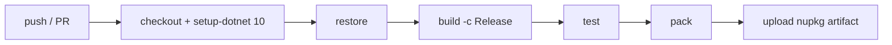

# S-01 — Scaffolding & CI

## 1. Metadata

- **Sprint ID:** S-01
- **Title:** Scaffolding & CI
- **Status:** Draft (awaiting review)
- **PRD references:** M0 (Foundations), FR-29 (package name), NFR-7 (docs), NFR-8 (targets),
  PRD §9.1, §10.1
- **Prerequisites:** S-00 (for the env defaults it proposes)
- **Depends-on (future sprints that need this):** S-02..S-14
- **Owner:** TBD

---

## 2. Outcome

A **green, multi-targeted solution skeleton** that builds the `RxStateMachine` package, runs a
trivial test and sample, packs a NuGet, and passes CI — proving the toolchain **before any engine
code** exists. Nothing about the API is designed here; the goal is a reliable workspace.

### 2.1 Definition of Done

- [ ] `src/RxStateMachine` multi-targets `netstandard2.0;net10.0`, nullable enabled, XML docs on.
- [ ] A trivial xUnit test project runs green against the library.
- [ ] A runnable smoke sample project runs and prints output.
- [ ] GitHub Actions CI green: build + test + pack on `ubuntu-latest` and `windows-latest`.
- [ ] `dotnet pack` produces `RxStateMachine.0.1.0.nupkg` with XML docs + symbols.
- [ ] Benchmark harness project compiles (empty benchmark set).
- [ ] Docs skeleton in place (`docs/` + placeholder index) and builds.
- [ ] `Directory.Build.props` carries shared settings; netstandard2.0 shims (`IsExternalInit`,
      `RequiredMemberAttribute`) verified by a compile-time test (validates NFR-8).
- [ ] `README` / repo hygiene updated (build badges, how-to-run).

---

## 3. Concepts & Vocabulary

### Target framework / multi-targeting

- **What it is:** building one project against several .NET frameworks at once. `netstandard2.0` is a
  _compatibility_ target (runs on .NET Framework 4.6.1+, .NET Core 2+, .NET 5+); `net10.0` is the
  modern LTS. `TargetFrameworks = "netstandard2.0;net10.0"`.
- **Example:** `dotnet build` produces an assembly usable by both old and new consumers.

### LangVersion

- **What it is:** the C# language version the compiler accepts. With multi-targeting you can use a
  modern language version, but runtime features need shims on old targets.
- **Example:** `records` and `init` are language features; on netstandard2.0 they need `IsExternalInit`.

### Shim (`IsExternalInit`, `RequiredMemberAttribute`)

- **What it is:** a tiny hand-written type that _adds a missing BCL type_ so newer C# syntax compiles
  on older targets.
- **Example:** `internal static class IsExternalInit { }` in a `Polyfills` file makes `init`/records
  compile on netstandard2.0.

### `#if NET8_0_OR_GREATER`

- **What it is:** a compile-time symbol gate. The SDK defines this automatically for net8.0 **and
  later** (including net10.0); it is _not_ defined for netstandard2.0.
- **Example:** use `TimeProvider` only under this `#if`; fall back to `DateTimeOffset.UtcNow`
  elsewhere (NFR-6).

### Nullable reference types

- **What it is:** compile-time flow analysis that warns when a reference could be null where it
  shouldn't. `EnableNullable = true`.
- **Example:** `string? maybe` vs `string notNull`.

### `Directory.Build.props`

- **What it is:** a single file at the repo root whose MSBuild properties apply to _all_ projects.
- **Example:** put `LangVersion`, `Nullable`, `TreatWarningsAsErrors`, `Deterministic` there once.

### CI (Continuous Integration)

- **What it is:** a service (GitHub Actions) that builds + tests + packs on every push/PR, so the
  repo is always verifiable.
- **Example:** `.github/workflows/ci.yml` runs `dotnet build` / `dotnet test` / `dotnet pack`.

### NuGet pack

- **What it is:** producing the installable `.nupkg` package. Metadata (id, version, description,
  authors) comes from the `.csproj`.
- **Example:** `dotnet pack` → `artifacts/RxStateMachine.0.1.0.nupkg`.

### Project reference vs package reference

- **What it is:** a project reference compiles the library from source (used in tests/samples in
  this repo); a package reference downloads a built package (how consumers use it).
- **Example:** samples use `<ProjectReference>` now; later CI can verify `<PackageReference>`
  consumption via a test that installs the packed nupkg.

### Sample-as-integration-test

- **What it is:** a runnable sample that also _verifies_ behaviour by running and asserting/printing
  expected output — a cheap end-to-end test.
- **Example:** the smoke sample prints "Hello RxStateMachine" and exits 0.

### BenchmarkDotNet / xUnit / FsCheck

- **What it is:** BenchmarkDotNet = reliable performance micro-benchmarks; xUnit = unit-test
  framework; FsCheck = property-based testing (random inputs against invariants). All referenced in
  PRD §11.

---

## 4. Tasks

### T1 — Solution & layout

- **Goal:** create the repository skeleton per S-00 §4.3 / README §8.
- **Work to perform:**
  1. `dotnet new sln -n RxStateMachine`
  2. Create folders: `src/RxStateMachine`, `tests/RxStateMachine.Tests`,
     `samples/HelloRxStateMachine`, `benchmarks/RxStateMachine.Benchmarks`, `docs`.
  3. Add projects to the solution.
- **Files / locations:** repo root.
- **Acceptance criteria:** `dotnet sln list` shows all projects; `dotnet build` succeeds.
- **Tests / Samples:** n/a (build-only).

### T2 — Library project + shared props

- **Goal:** the multi-targeted library compiles with shared settings.
- **Work to perform:**
  1. `src/RxStateMachine/RxStateMachine.csproj`:
     `TargetFrameworks = "netstandard2.0;net10.0"`, `Nullable = enable`,
     `GenerateDocumentationFile = true`, `Deterministic = true`, package metadata
     (`PackageId = RxStateMachine`, `Version = 0.1.0`, description, authors, repository URL).
  2. `Directory.Build.props` at root: `LangVersion` (latest), `Nullable`, `ImplicitUsings`,
     `TreatWarningsAsErrors` (opt-in later if desired), `Deterministic`.
  3. Add a `Polyfills/` folder with `IsExternalInit` + `RequiredMemberAttribute` shims (netstandard2.0
     only, via `#if` or a separate target-conditional compile item).
  4. Add a placeholder file (e.g., `Placeholder.cs`) so the library has real content to compile;
     remove it in S-02.
- **Files / locations:** `src/RxStateMachine/`, `Directory.Build.props`.
- **Acceptance criteria:** `dotnet build src/RxStateMachine -c Release` succeeds for both targets.
- **Tests / Samples:** n/a (build-only).

### T3 — netstandard2.0 shim verification (NFR-8)

- **Goal:** prove records/init/required compile on netstandard2.0 before the engine relies on them.
- **Work to perform:**
  1. In the library, add a small internal record with `init` + a `required` member + a
     `TimeProvider`-gated `#if NET8_0_OR_GREATER` timestamp helper (matching NFR-6 wording).
  2. Add a test in the test project (T4) that constructs it and asserts the timestamp is populated.
- **Files / locations:** `src/RxStateMachine/` (polyfill + a `PolyfillSmoke.cs`),
  `tests/RxStateMachine.Tests/`.
- **Acceptance criteria:** compiles on both targets; test passes on net10.0.
- **Tests / Samples:** `PolyfillSmokeTests` (record + required + timestamp).
- **Samples:** n/a.

### T4 — Test project

- **Goal:** a green xUnit project wired to the library.
- **Work to perform:**
  1. `tests/RxStateMachine.Tests` (xUnit, `net10.0`) with `<ProjectReference>` to the library.
  2. Trivial smoke test: load the `RxStateMachine` assembly, assert it exists and reports both target
     frameworks (via reflection over `TargetFrameworkAttribute`); plus the T3 polyfill test.
- **Files / locations:** `tests/RxStateMachine.Tests/`.
- **Acceptance criteria:** `dotnet test` green.
- **Tests / Samples:** `AssemblySmokeTests`, `PolyfillSmokeTests`.
- **Samples:** n/a.

### T5 — Smoke sample project

- **Goal:** a runnable console app that references the library (project ref) and prints output — the
  first "sample-as-integration-test".
- **Work to perform:**
  1. `samples/HelloRxStateMachine` (`net10.0` console).
  2. Program prints "Hello RxStateMachine — targets: …" (reads the assembly attribute) and returns
     exit code 0.
- **Files / locations:** `samples/HelloRxStateMachine/`.
- **Acceptance criteria:** `dotnet run --project samples/HelloRxStateMachine` prints the message.
- **Tests / Samples:** the sample itself is the integration smoke; later sprints will assert its
  output in CI.
- **Samples:** `HelloRxStateMachine`.

### T6 — Benchmark harness stub

- **Goal:** a BenchmarkDotNet project that compiles (no real benchmarks yet — those come in S-14).
- **Work to perform:**
  1. `benchmarks/RxStateMachine.Benchmarks` referencing BenchmarkDotNet.
  2. `Program.cs` that supports `--filter *` and an empty `[MemoryDiagnoser]` benchmark class stub.
- **Files / locations:** `benchmarks/RxStateMachine.Benchmarks/`.
- **Acceptance criteria:** project builds; `dotnet run -c Release -- --filter *` runs and reports the
  empty set.
- **Tests / Samples:** n/a.

### T7 — Docs skeleton

- **Goal:** a minimal docs site placeholder (NFR-7) that can grow into the API reference + samples.
- **Work to perform:**
  1. `docs/index.md` (one page: project name, link to PRD, link to samples, "API docs coming in
     S-14").
  2. A `docfx.json` (or a simple static generator of your choice) that builds the folder; keep it
     minimal and swappable.
- **Files / locations:** `docs/`.
- **Acceptance criteria:** `docs` builds without errors.
- **Tests / Samples:** n/a.

### T8 — CI pipeline

- **Goal:** automated build + test + pack on push/PR.
- **Work to perform:** create `.github/workflows/ci.yml` per the sketch below.
- **Files / locations:** `.github/workflows/ci.yml`, plus a badge + "how to run" section in `README`.
- **Acceptance criteria:** pipeline green on a pushed branch for both OSes.
- **Tests / Samples:** n/a.

```yaml
name: ci
on: [push, pull_request]
jobs:
  build:
    strategy:
      matrix:
        os: [ubuntu-latest, windows-latest]
    runs-on: ${{ matrix.os }}
    steps:
      - uses: actions/checkout@v4
      - uses: actions/setup-dotnet@v4
        with:
          dotnet-version: "10.0.x"
      - run: dotnet restore
      - run: dotnet build -c Release --no-restore
      - run: dotnet test  -c Release --no-build
      - run: dotnet pack src/RxStateMachine -c Release -o ./artifacts --no-build
      - uses: actions/upload-artifact@v4
        with:
          name: nupkg-${{ matrix.os }}
          path: artifacts/
```

### T9 — Pack verification

- **Goal:** confirm the package is consumable.
- **Work to perform:**
  1. `dotnet pack src/RxStateMachine -c Release -o artifacts`.
  2. Inspect the nupkg (contents, XML docs, symbols) — `unzip -l` or `dotnet nuget` tooling.
  3. (Optional, nice-to-have) a tiny consumer test that references the **packed** nupkg via a local
     feed and builds — proves it's installable, not just project-referenceable.
- **Files / locations:** `artifacts/`, `src/RxStateMachine/RxStateMachine.csproj`.
- **Acceptance criteria:** nupkg contains lib/ for both targets + XML docs + symbols.
- **Tests / Samples:** optional consumer smoke.

### T10 — Verify DoD & tidy

- **Goal:** close the sprint.
- **Work to perform:** run the full local command set (restore/build/test/pack/run sample/build docs),
  fix any toolchain issues, update the README §6.1 status (S-01 → Done), record anything learned in
  the progress log.
- **Files / locations:** repo-wide.
- **Acceptance criteria:** §2.1 DoD all checked.
- **Tests / Samples:** all of the above.

---

## 5. Example scenarios

### Scenario: the "first green build" walkthrough

- **Context:** the acceptance path every developer runs after cloning.
- **Walkthrough:**
  1. `dotnet restore` — downloads SDK-required packages.
  2. `dotnet build -c Release` — compiles the multi-targeted library (both targets) + tests + sample.
  3. `dotnet test` — runs the smoke + polyfill tests (T3/T4).
  4. `dotnet run --project samples/HelloRxStateMachine` — prints the smoke message.
  5. `dotnet pack src/RxStateMachine -c Release -o artifacts` — produces the nupkg.
- **State table:** n/a (no machine yet).
- **Diagram (pipeline):**



### Scenario: folder layout after T1/T2

```text
RxStateMachine/
├── .github/workflows/ci.yml
├── Directory.Build.props
├── RxStateMachine.sln
├── src/RxStateMachine/           # netstandard2.0 + net10.0
│   ├── RxStateMachine.csproj
│   ├── Placeholder.cs            # removed in S-02
│   └── Polyfills/                # IsExternalInit, RequiredMemberAttribute
├── tests/RxStateMachine.Tests/   # xUnit, net10.0
├── samples/HelloRxStateMachine/
├── benchmarks/RxStateMachine.Benchmarks/
├── docs/
└── Docs/Sprint Planning/
```

---

## 6. Tests & samples checklist

- [ ] `AssemblySmokeTests` — assembly loads, targets reported (T4)
- [ ] `PolyfillSmokeTests` — record + required + timestamp on net10.0 (T3/T4)
- [ ] Smoke sample runs and prints expected output (T5)
- [ ] CI green on ubuntu + windows (T8)
- [ ] Pack verified — nupkg has both target libs + XML docs + symbols (T9)

---

## 7. Risks & tricky bits

- **netstandard2.0 + modern C# shims fail** → fallback: per-target `LangVersion`, or avoid the
  feature; T3 catches this before the engine depends on it.
- **net10.0 SDK availability** → confirm `dotnet --list-sdks` shows 10.0.x before starting; install
  via the .NET SDK manager if needed.
- **CI Windows quirks** (line endings, path casing) → normalize in gitattributes; CI runs catch it.
- **NuGet restore of System.Reactive 6.x on netstandard2.0** → supported; pin the version in
  `Directory.Packages.props` (Central Package Management) to keep it consistent.

---

## 8. Progress log / resume

| Task | Status      | Notes                  |
| ---- | ----------- | ---------------------- |
| T1   | Not started | —                      |
| T2   | Not started | —                      |
| T3   | Not started | —                      |
| T4   | Not started | —                      |
| T5   | Not started | —                      |
| T6   | Not started | —                      |
| T7   | Not started | —                      |
| T8   | Not started | CI yaml sketched above |
| T9   | Not started | —                      |
| T10  | Not started | —                      |

**If work is interrupted, resume here:**

- Nothing in flight; tasks are listed in execution order.

**Next actions on resume:**

1. Run `dotnet --list-sdks`; install .NET 10 SDK if missing.
2. Start at T1 and work through T10 in order.

**Checkpoint notes:**

- Uses S-00 §4.3 env defaults (SDK 10, GitHub Actions, package id `RxStateMachine`, v0.1.0).
- Consider Central Package Management (`Directory.Packages.props`) for pinned versions (System.Reactive 6.x, xUnit, FsCheck, BenchmarkDotNet).

---

## 9. Change control

> **Change control.** This document is derived from `Docs/RxStateMachine PRD.md` (the source of
> truth). If during development you are instructed — or conclude — that a change **deviates from the
> PRD** (new behavior, changed signature, removed feature, altered semantics), you MUST:
>
> 1. **Stop** and record the proposal in `Docs/Sprint Planning/README.md` → Change Control Register
>    (what, why, which `FR`/`NFR`/`UC` affected).
> 2. **Cross-reference the PRD**: confirm whether it should be updated and draft the edit (section,
>    old/new text).
> 3. **Check this sprint and all future sprint documents for conflict**; update affected tasks,
>    prerequisites, and the dependency map.
> 4. **Do not implement** the change until the PRD update is confirmed (or explicitly waived and
>    recorded).

**Nuance:** because v1 has no hard contracts, an API change that merely refines a _suggestion_ and is
validated by tests/samples — without contradicting the PRD — is a normal part of development. Record
it in this sprint's Progress Log (Checkpoint notes), not the Change Control Register.
