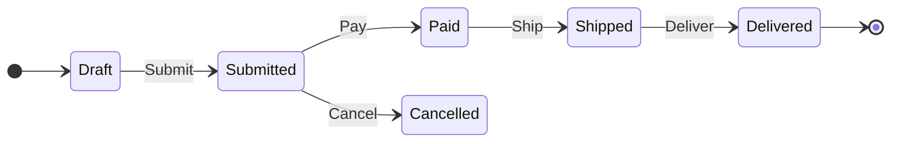

# Diagrams and Example Exports

## Producer / consumer flow

The diagram is on [observable-model.md](observable-model.md) and in the repository `README.md`.

## Example exports (Mermaid & D2)

_Informational only — illustrative output that the diagram export feature will produce from a
machine's configuration graph. Exact syntax and annotation detail are settled during specification and
planning._

Using the order lifecycle from UC-1 ([use-cases.md](use-cases.md)):

```csharp
machine.Configure(OrderState.Draft)
    .Permit(OrderTrigger.Submit, OrderState.Submitted);
machine.Configure(OrderState.Submitted)
    .Permit(OrderTrigger.Pay, OrderState.Paid)
    .Permit(OrderTrigger.Cancel, OrderState.Cancelled);
machine.Configure(OrderState.Paid)
    .Permit(OrderTrigger.Ship, OrderState.Shipped);
machine.Configure(OrderState.Shipped)
    .Permit(OrderTrigger.Deliver, OrderState.Delivered);
```

**Mermaid** (`stateDiagram-v2`):



**D2** (`.d2`) — can be rendered with the [D2 CLI](https://d2lang.com):

```d2
direction: right

start: {
    shape: circle
}
end: {
    shape: circle
}

start -> Draft
Draft -> Submitted: Submit
Submitted -> Paid: Pay
Submitted -> Cancelled: Cancel
Paid -> Shipped: Ship
Shipped -> Delivered: Deliver
Delivered -> end
```

Notes:

- Guards, entry/exit actions, and parameterized payloads can be annotated as edge labels/details
  (Mermaid `:label` and D2 edge labels) — the detail level is a formatter decision.
- Export rules (determinism, escaping, detail levels) are in
  [design-decisions.md](design-decisions.md), DD-20.
