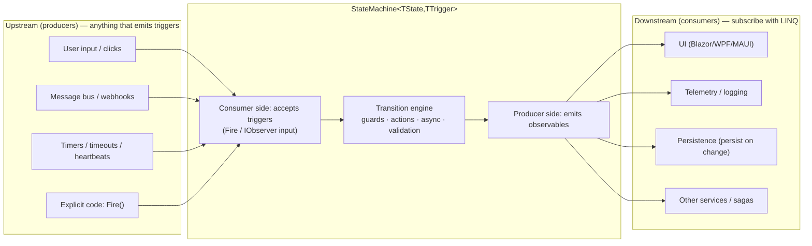

# The Observable Model (Producer / Consumer)

This is the heart of the design.

## Core mental model

An `IObservable<T>` is a **push-based, potentially-lazy stream**: a **producer** pushes `OnNext`
values, `OnError`, and `OnCompleted` to **consumers** (observers), who react with LINQ-style operators.

A state machine sits in the middle of two flows:



- **Producer side (outputs):** the machine exposes streams for _current state_, _transitions_, _guard
  results_, _permitted triggers_, and _errors_.
- **Consumer side (inputs):** triggers arrive either imperatively (`Fire(...)`) or by piping an
  upstream observable into the machine (for example,
  `messageBus.Observe<OrderEvent>().Subscribe(machine)`).

## Architecture baseline

The machine is **both** a producer and a consumer:

- **Producer.** The machine is an `IObservable<TState>` and exposes the streams listed below. State
  and transitions are **hot** and **replay the latest value** (`BehaviorSubject`-backed), so late
  subscribers receive the current state immediately. All streams are disposable and compose with
  standard Rx operators.
- **Consumer.** Triggers are accepted two ways, driving the same transition engine so there is exactly
  one behavior regardless of how a trigger arrives:
  1. **Imperative** — `Fire(...)` / `FireAsync(...)`.
  2. **Reactive** — the machine is an observer of triggers, so any observable can be piped directly
     in: `messageBus.Observe<OrderEvent>().Subscribe(machine)`. Payload-carrying triggers use a
     wrapper that pairs a trigger with its payload (see [design-decisions.md](design-decisions.md),
     DD-02).

**Benefits of this structure:**

- Business logic stays readable and async-friendly (a classic FSM core) while everything is available
  to reactive consumers.
- No adapters or manual `Subject` wiring: observable streams compose directly with the Rx ecosystem.
- Consumers that prefer imperative `Fire()` get full functionality without needing to learn Rx.

## Streams the machine exposes

| Stream               | Type                                              | Semantics                                                                               |
| -------------------- | ------------------------------------------------- | --------------------------------------------------------------------------------------- |
| Current state        | `IObservable<TState>` (machine itself)            | Hot, replays last (`BehaviorSubject`-backed) so late subscribers get the current state  |
| State changed        | `IObservable<StateChange<TState>>`                | `Previous`, `Current`, `Timestamp`, `IsReentry`, `IsInternal`                           |
| Transition           | `IObservable<Transition<TState,TTrigger>>`        | `Source`, `Destination`, `Trigger`, payload, kind, duration                             |
| Transition completed | `IObservable<Transition<TState,TTrigger>>`        | Fired after the last entry action completes                                             |
| Guard result         | `IObservable<GuardResult<TState,TTrigger>>`       | Every guard evaluation (for logging, tests, and "why blocked?" UI)                      |
| Permitted triggers   | `IObservable<PermittedTriggers<TState,TTrigger>>` | Re-emitted when the state changes; also queryable via `GetPermittedTriggers()`          |
| Errors               | `IObservable<StateMachineError>`                  | Unhandled triggers, guard/action exceptions (depending on policy); never configuration errors |

Precise emission order, error handling, and permitted-trigger re-emission are defined in
[design-decisions.md](design-decisions.md) (DD-08, DD-13, DD-15). Type and member names on this page
are illustrative.

## Worked examples

**Example 1 — Producer only (most common):** a checkout UI wants to drive a progress bar and disable
buttons. The consumer needs **no** trigger wiring.

```csharp
var machine = new StateMachine<OrderState, OrderTrigger>(OrderState.Draft);

machine.Configure(OrderState.Draft)
    .Permit(OrderTrigger.Submit, OrderState.Submitted);

machine.Configure(OrderState.Submitted)
    .PermitIf(OrderTrigger.Pay, OrderState.Paid, () => _payment.Succeeded, "payment succeeded")
    .Permit(OrderTrigger.Cancel, OrderState.Cancelled);

// Producer usage: pure LINQ over state
machine
    .Where(s => s is OrderState.Paid or OrderState.Cancelled)
    .Subscribe(_ => NotifyAccounting());

machine.Subscribe(state => progressBar.Value = ProgressFor(state)); // BehaviorSubject replays current state

machine.Fire(OrderTrigger.Submit);      // imperative input
```

**Example 2 — Fully reactive input (same machine, no manual Fire):** wire a payment gateway's events
straight into the machine, and cancel an order that stalls in `Submitted`.

```csharp
paymentGateway.PaymentSucceeded        // IObservable<PaymentReceipt>
    .Select(receipt => new TriggerWithParameters<OrderTrigger, PaymentReceipt>(OrderTrigger.Pay, receipt))
    .Subscribe(machine);               // payload-carrying triggers use the wrapper

// A timeout scoped to the state: armed on entering Submitted, cancelled automatically on leaving it
machine.Configure(OrderState.Submitted)
    .TimeoutAfter(TimeSpan.FromMinutes(10), OrderTrigger.Cancel);   // illustrative timer helper
```

A timeout belongs to a state, so it cannot fire after the order has left it; see
[design-decisions.md](design-decisions.md), DD-01 and DD-17.
