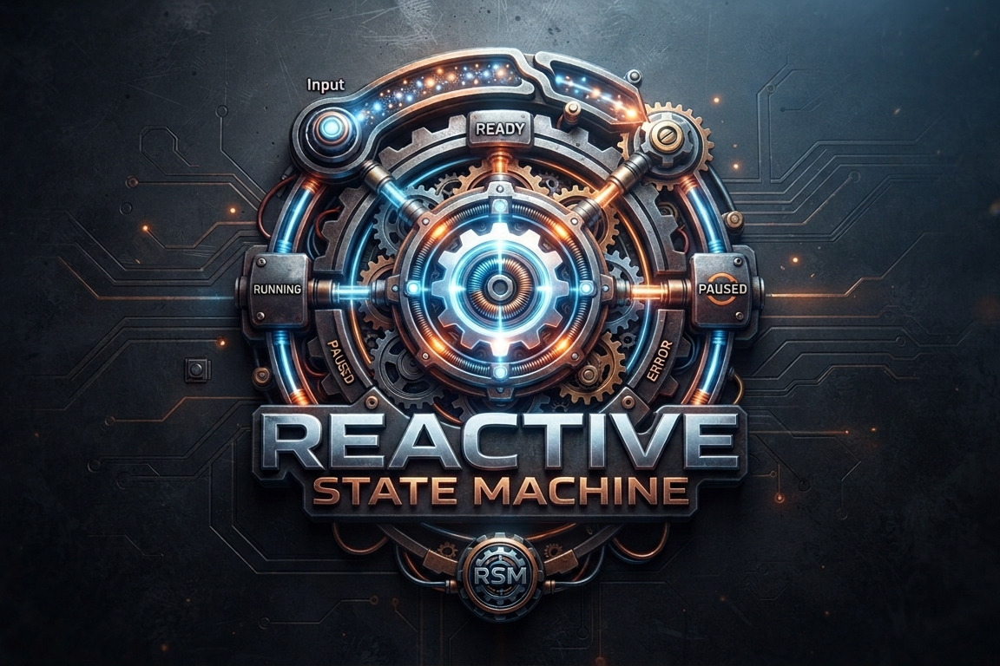

<table>
  <tr>
    <td width="340" valign="top">
      
    </td>
    <td valign="top">

# RxStateMachine


> **Define your state machines in a few lines of type-safe C#; subscribe to state and transitions
> like any other reactive stream; and wire triggers from anything that emits values — or just call
> `Fire()` when that's simpler.**

**RxStateMachine** is a generic, type-safe, **observable-first** state machine library for .NET.
It pairs the familiar fluent configuration style of classic .NET state machine libraries with the
composition power of System.Reactive (Rx).

</td>
</tr>
</table>

> **Status:** in planning. The capabilities below describe what the library is being built to do;
> they are not all available yet.

The machine is both a **producer** and a **consumer**:

- **Producer** — it exposes its current state, transitions, guard results, permitted triggers, and
  errors as hot observable streams that any consumer can subscribe to with plain LINQ operators.
- **Consumer** — triggers can be pushed imperatively (`Fire(...)`) _and/or_ wired directly from
  other observable streams: message buses, UI events, timers, webhooks — no adapters required.

It builds on System.Reactive and carries no dependency on any application framework (UI, DI,
messaging, or storage), so it works the same in console apps, services, desktop and mobile clients,
IoT gateways, and backend microservices.

## Why RxStateMachine?

Order lifecycles, payment flows, approval workflows, device connections, and UI wizards are all
finite-state processes. Hand-rolled `enum` + `switch` code becomes hard to maintain and test as guards,
side effects, and async steps accumulate.

Existing .NET state machine libraries are usually built around events and imperative `Fire()` calls.
RxStateMachine is _natively observable_, so it composes directly with the Rx ecosystem you already use
for UI binding, telemetry, and stream processing — while keeping the readability and async support of
a classic state machine core.

## Capabilities

- **Fluent, type-safe configuration** with guards, entry/exit/transition actions, and typed payloads.
- **Observable outputs and inputs** — subscribe to state and transitions; drive the machine from any
  observable or with a plain call.
- **Async and cancellation** with explicit, configurable error handling.
- **Introspection** that explains why a transition was blocked.
- **Timers and timeouts**, deterministic under virtual time in tests.
- **Hierarchical states**, **snapshot persistence**, and **diagram export** (Mermaid and D2).
- **Optional queued mode** that is safe to drive from many threads.

## A quick look

```csharp
var machine = new StateMachine<OrderState, OrderTrigger>(OrderState.Draft);

machine.Configure(OrderState.Draft)
    .Permit(OrderTrigger.Submit, OrderState.Submitted);

machine.Configure(OrderState.Submitted)
    .PermitIf(OrderTrigger.Pay, OrderState.Paid, () => _payment.Succeeded, "payment confirmed")
    .Permit(OrderTrigger.Cancel, OrderState.Cancelled);

// Producer: pure LINQ over state — drive a UI, telemetry, or persistence
machine
    .Where(s => s is OrderState.Paid or OrderState.Cancelled)
    .Subscribe(_ => NotifyAccounting());

// Consumer: wire any observable in, or just Fire() when that's simpler
machine.Fire(OrderTrigger.Submit);
```

## Learn more

- [Vision and goals](Docs/vision.md)
- [The observable model](Docs/observable-model.md)
- [Example use cases](Docs/use-cases.md)
- [Glossary](Docs/glossary.md)
- [References & Further Reading](Docs/references.md)

## License

[MIT](./LICENSE) © 2026 Malcolm Smith
