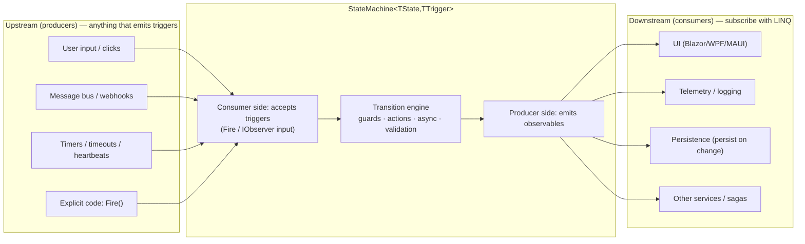

<table>
  <tr>
    <td width="340" valign="top">
      
    </td>
    <td valign="top">

# RxStateMachine


> **Define your state machines in a few lines of type-safe C#; subscribe to state and transitions
> like any other reactive stream; and wire triggers from anything that emits values — or just call
> `Fire()` when that's simpler.**

**RxStateMachine** is a generic, type-safe, **observable-first** state machine library for .NET.
It pairs the familiar fluent configuration style of classic .NET state machine libraries with the
composition power of System.Reactive (Rx).

</td>
</tr>
</table>

The machine is both a **producer** and a **consumer**:

- **Producer** — it exposes its current state, transitions, guard results, permitted triggers, and
  errors as hot observable streams that any consumer can subscribe to with plain LINQ operators.
- **Consumer** — triggers can be pushed imperatively (`Fire(...)`) _and/or_ wired directly from
  other observable streams: message buses, UI events, timers, webhooks — no adapters required.



Built on System.Reactive and targeting `netstandard2.0` + `net10.0` + `net11.0`, it carries no dependency on any
application framework (UI, DI, messaging, or storage), so it works identically in console apps,
services, Blazor/WPF/MAUI clients, IoT gateways, and backend microservices.

---

## Why RxStateMachine?

Business and technical domains are full of finite-state processes — order lifecycles, payment flows,
approval workflows, device connection lifecycles, job processing, UI wizards. Teams typically
hand-roll ad-hoc `enum` + `switch` statements that quickly become unmaintainable and untestable as
guards, side effects, and async steps accumulate.

Existing .NET state machine libraries are usually built around **events** and imperative `Fire()`
calls. RxStateMachine takes a different approach: the state machine is _natively observable_, so it
composes directly with the System.Reactive ecosystem already used for UI binding, telemetry, message
buses, and stream processing.

The result is the best of both worlds:

- the **readability, async support, and debuggability** of a classic state machine core — plain
  `async`/`await` in entry/exit/transition actions, not `SelectMany` spaghetti; and
- the **composition power of Rx** for consumers — `DistinctUntilChanged`, `Throttle`, `Buffer`,
  `CombineLatest`, scheduler control, hot/cold semantics, and painless UI / telemetry / persistence
  binding.

## Capabilities

The library is designed around a small but powerful core:

- **Fluent configuration** — `Configure(state).Permit(...)`, `PermitIf(...)`, `PermitReentry(...)`,
  and internal transitions.
- **Actions & guards** — entry/exit/transition actions, trigger-specific entry actions, guards with
  human-readable descriptions, and async variants of all of them.
- **Parameterized triggers** — typed payloads that flow through guards, actions, and the transition
  streams.
- **Observable surface** — hot streams for state changes, transitions, guard results, permitted
  triggers, and errors, all composing with standard Rx operators.
- **Hybrid input** — triggers arrive via `Fire(...)`/`FireAsync(...)` _or_ by subscribing any
  observable straight into the machine.
- **Introspection** — permitted triggers, machine info, and guard descriptions that answer _"why is
  this transition blocked?"_
- **Explicit error handling** — configurable policies for unhandled triggers and exceptions, with
  rich error objects.
- **Hierarchical states** — nested states with selectable history and a membership test that
  covers descendants.
- **Timers & timeouts** — fire a trigger after a delay, or after the machine has sat in a state
  for too long, with the timing cancelled automatically when that state is left.
- **Persistence** — keep the current state in your own store, or capture and restore a snapshot so
  a long-running process survives a restart.
- **Firing modes** — immediate by default, or an opt-in queued mode that is safe to drive from
  many threads at once.
- **Scheduler control** — choose the scheduler that notifications, timers, and queued work run on,
  so behaviour is deterministic under virtual time in tests.
- **Diagram export** — render the configured machine as Mermaid or D2 for documentation.

## A quick look

```csharp
var machine = new StateMachine<OrderState, OrderTrigger>(OrderState.Draft);

machine.Configure(OrderState.Draft)
    .Permit(OrderTrigger.Submit, OrderState.Submitted);

machine.Configure(OrderState.Submitted)
    .PermitIf(OrderTrigger.Pay, OrderState.Paid, () => _payment.Succeeded, "payment confirmed")
    .Permit(OrderTrigger.Cancel, OrderState.Cancelled);

// Producer: pure LINQ over state — drive a UI, telemetry, or persistence
machine
    .Where(s => s is OrderState.Paid or OrderState.Cancelled)
    .Subscribe(_ => NotifyAccounting());

// Consumer: wire any observable in, or just Fire() when that's simpler
paymentGateway.PaymentSucceeded
    .Select(receipt => new TriggerWithParameters<OrderTrigger, PaymentReceipt>(OrderTrigger.Pay, receipt))
    .Subscribe(machine);

machine.Fire(OrderTrigger.Submit);
```

## License

[MIT](./LICENSE) © 2026 Malcolm Smith
